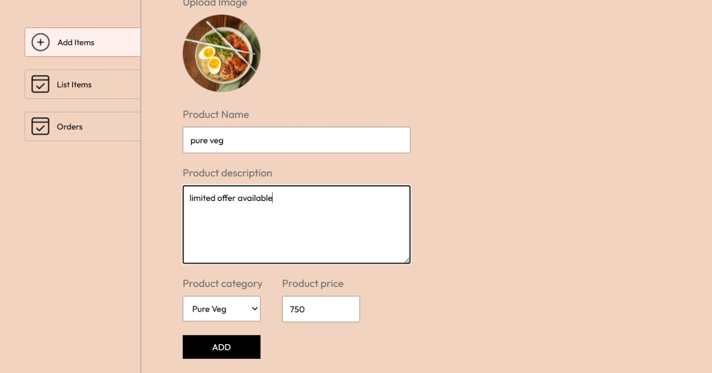
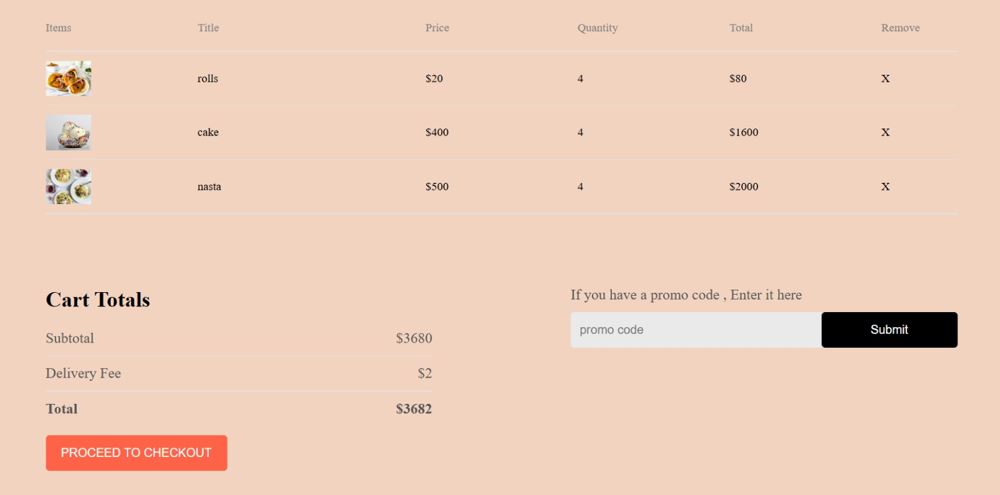
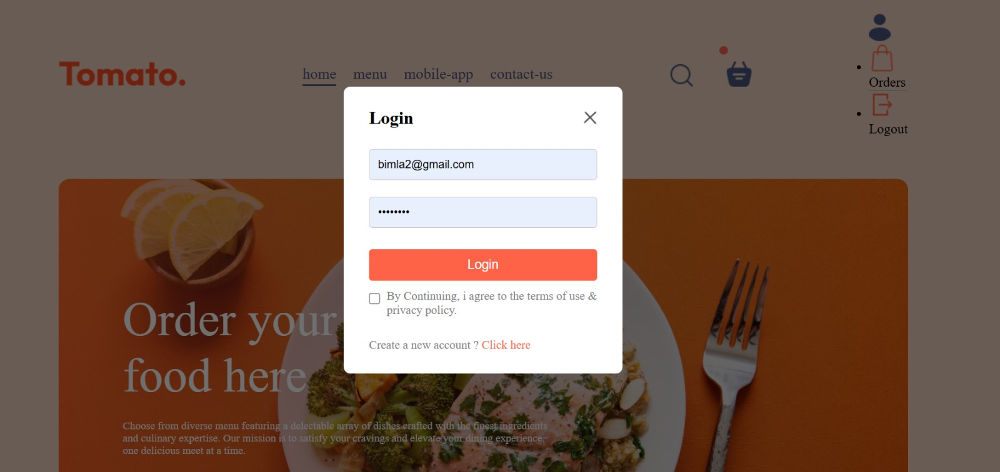

# 🍔 Food Delivery Web Application

A full-stack Food Delivery Web Application that allows users to browse food items, add them to cart, and place orders. It also includes an Admin Panel to manage food items and orders efficiently.

---

## 📌 Features

### 👤 User Features
- User Authentication (Login & Sign Up)
- Browse food items
- Search and filter items
- Add to Cart / Remove from Cart
- Checkout and place orders
- View order history
- User profile management

---

### 🛠️ Admin Features
- Add new food items
- Update food details
- Delete food items
- View all orders
- Update order status (Pending / Preparing / Delivered)

---

## 🖼️ Screenshots
## 🖼️ Application Preview

### 🔐 admin panel/add items

### 🏠 admin panel/order list

### 🍔 user/ cart

### 🛒 order items

### 💳 sign ,login in

### 📦 Orders Page

---

## 🏗️ Tech Stack

Frontend:
- HTML
- CSS
- JavaScript
- React.js

Backend:
- Node.js
- Express.js

Database:
- Mysql

Authentication:
- JWT (JSON Web Token)

---

## 📂 Folder Structure

food-delivery-app/
│
├── frontend/
├── backend/
├── admin/
├── screenshots/
└── README.md

---

## ⚙️ Installation & Setup

### Clone Repository
git clone (https://github.com/Bimla-tech/foodelivery)  
cd food-delivery-app 

---

### Install Dependencies

Backend:
cd backend  
npm install  

Frontend:
cd frontend  
npm install  

Admin Panel:
cd admin  
npm install  

---

### Environment Variables

Create a `.env` file in backend:

PORT=5000  
MONGO_URI=your_mongodb_connection_string  
JWT_SECRET=your_secret_key  

---

### Run Project

Start Backend:
cd backend  
npm start  

Start Frontend:
cd frontend  
npm start  

Start Admin Panel:
cd admin  
npm start  

---

## 🔐 Authentication Flow

- User registers with email & password
- Password is hashed securely
- JWT token is generated on login
- Protected routes require authentication
- Admin routes are restricted

---

## 📡 API Endpoints

Auth:
POST /api/auth/register  
POST /api/auth/login  

Food:
GET /api/food  
POST /api/food (Admin)  
PUT /api/food/:id (Admin)  
DELETE /api/food/:id (Admin)  

Cart:
POST /api/cart/add  
POST /api/cart/remove  

Orders:
POST /api/order  
GET /api/order/user  
GET /api/order/admin  

## 🤝 Contributing

1. Fork the repository  
2. Create a new branch  
3. Commit your changes  
4. Push to your branch  
5. Create a Pull Request  

---

## 📄 License

This project is licensed under the MIT License.

---

## 👨‍💻 Author

Bimla godara
GitHub: https://github.com/Bimla-tech
LinkedIn:https://www.linkedin.com/in/bimla-godara-8457792a0

---

## ⭐ Support

If you like this project, give it a star ⭐
